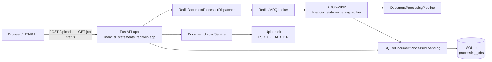

# Project Agent Guide

> Scope: Root project. These instructions apply to the whole repository unless a nested AGENTS.md overrides them.

## Quick Facts

| Area | Details |
|------|---------|
| Project | FastAPI backend for uploading financial statement PDFs and tracking document processing jobs. |
| Language | Python 3.14.6 |
| Package/build | `pyproject.toml` with Hatchling |
| Web stack | FastAPI, Jinja2, HTMX, Materialize CSS |
| State | Redis-backed ARQ dispatch, SQLite append-only `processing_jobs` history and latest-state reads |
| Test/lint | pytest, mypy strict, Ruff |
| Local services | Redis through Docker Compose |

## Repository Tour

Trimmed project map:

```text
.
├── financial_statements_rag/
│   ├── jobs.py              # Job models, SQLite event log, processor service
│   ├── logging.py           # Package logging configuration
│   ├── main.py              # ASGI app and CLI entrypoint
│   ├── pipeline.py          # DocumentProcessingPipeline protocol and no-op implementation
│   ├── queue.py             # ARQ dispatcher for enqueueing document jobs
│   ├── settings.py          # FSR_* environment settings
│   ├── storage.py           # DocumentUploadService and uploaded PDF persistence
│   ├── worker.py            # ARQ worker startup, job processing, and status updates
│   └── web/
│       ├── app.py           # FastAPI app factory and dependency wiring
│       ├── routes.py        # Index, upload, and job status routes
│       └── templates/       # Jinja/HTMX/Materialize templates
├── tests/                   # Unit and route tests
├── plans/                   # Superplan/superbuild implementation plan
├── docs/                    # Design/spec documents
├── examples/                # Example input PDFs
├── Dockerfile
├── docker-compose.yml
├── Makefile
└── README.md
```

## Architecture

- Uploads enter through `POST /upload`, are validated and saved by `DocumentUploadService`, then create one document processing job per PDF.
- The FastAPI app creates a `JobRecord`, appends every lifecycle change to SQLite through `SQLiteDocumentProcessorEventLog`, and uses SQLite history for latest-state reads.
- `RedisDocumentProcessorDispatcher` enqueues `process_document_job` onto ARQ. The worker loads the same `Settings`, configures logging, and updates job state as the pipeline runs.
- SQLite is append-only history. Every job creation/status transition inserts a new `processing_jobs` row.
- Status display reads the latest job state from SQLite history. The frontend polls `GET /jobs/{job_id}` every 2 seconds while a job is non-terminal.
- The processing boundary is `DocumentProcessingPipeline` with `status(job_id)` and `process(document_path, job_id)`. The current implementation is `DefaultDocumentProcessorPipeline`.
- FastAPI app construction is centralized in `financial_statements_rag/web/app.py`; route handlers should stay thin and delegate to services.

### Network Diagram



## Tooling And Setup

- Use Python `3.14.6`; `.python-version` is authoritative.
- Install dependencies with `make install`.
- Start Redis only with `make start_backing_services`.
- Start the local FastAPI app with `make start`.
- Start the full containerized stack with `docker compose up --build`.
- Runtime settings use the `FSR_*` prefix:
  - `FSR_REDIS_URL`
  - `FSR_SQLITE_DATABASE_PATH`
  - `FSR_UPLOAD_DIR`
  - `FSR_MAX_UPLOAD_COUNT`
  - `FSR_LOG_LEVEL`
- Do not commit runtime data under `data/`, build outputs, caches, or virtual environments.

## Common Tasks

- `make install` — install the package and dev dependencies into `.venv`.
- `make start_backing_services` — start Redis via Docker Compose.
- `make start` — run the FastAPI app locally.
- `make format` — format Python code with Ruff.
- `make lint` — run mypy strict and Ruff checks.
- `make test` — run pytest and doctests.
- `make build` — clean, lint, test, and build the package.
- `docker compose config` — validate the Compose file without starting containers.

## Testing And Quality Gates

- Add or update tests for behavior changes in `tests/`.
- Prefer behavioral tests over implementation-detail tests.
- Route tests should assert HTTP behavior, rendered data, and HTMX behavior that affects functionality.
- Do not write styling tests. Do not assert CSS framework class names, colors, spacing classes, or purely visual markup.
- Run `make format`, `make lint`, and `make test` before handing work back.
- Run `make build` for broader changes or when touching packaging, Docker, or dependencies.
- Coverage tooling is not currently configured; do not claim coverage thresholds were met unless tooling is added and run.

## Dos

- Prefer creating a class when two or more related functions share state, dependencies, or a domain concept. Example: use `DocumentUploadService` rather than scattered upload helper functions.
- Keep route handlers small; push domain behavior into services or focused modules.
- Use explicit protocols for swappable boundaries such as queues, processors, and event logs.
- Keep SQLite `processing_jobs` append-only. Add reads, not update/delete behavior, unless the data model is intentionally redesigned.
- Keep ARQ dispatch details centralized in `RedisDocumentProcessorDispatcher`.
- Preserve `job_id` in job lifecycle logs and rendered status updates.
- Use `FSR_*` for new runtime environment variables.
- Update `README.md` when setup, commands, runtime behavior, or user-facing workflows change.

## Don'ts

- Do not write tests that assert visual styling, CSS classes, Materialize-specific class names, colors, or layout-only markup.
- Do not log PDF contents.
- Do not store uploads using user-provided filenames as paths.
- Do not mutate SQLite history rows in place.
- Do not add new global settings with non-`FSR_*` prefixes.
- Do not run destructive git commands such as `git reset --hard` or `git checkout --` unless explicitly requested.

## Documentation Duties

- Update `README.md` for significant feature, setup, command, or environment changes.
- Update `plans/` or `docs/` only when the implementation plan or design spec would otherwise become misleading.
- Keep this `AGENTS.md` current when project conventions change.

## Finish The Task Checklist

- [ ] Run the relevant focused tests first when changing behavior.
- [ ] Run `make format`.
- [ ] Run `make lint`.
- [ ] Run `make test`.
- [ ] Run `make build` for packaging, dependency, Docker, or broad changes.
- [ ] Update `README.md` and other docs if behavior or workflow changed.
- [ ] Summarize changes with a conventional commit message, for example `feat(web): add upload history`.
- [ ] Call out any checks that could not be run and why.
